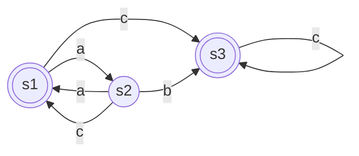
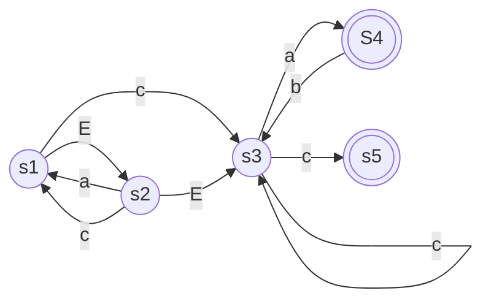

Grafico para instrucciones de un AFD:

```
s1,a,s2
s1,c,s3
s2,a,s1
s2,b,s3
s2,c,s1
s3,c,s3
```


```mermaid
flowchart LR
    A(((s1))) -- a --> B((s2));
    A((s1)) -- c --> C(((s3)));
    B((s2)) -- a --> A(((s1)));
    B((s2)) -- b --> C(((s3)));
    B((s2)) -- c --> A(((s1)));
    C(((s3))) -- c --> C(((s3)));
```

```
s1,E,s2
s1,c,s3
s2,a,s1
s2,E,s3
s2,c,s1
s3,c,s3
s3,a,s4
s4,b,s3
s4,c,s5
```


```mermaid
flowchart LR
    A((s1)) -- E --> B((s2));
    A((s1)) -- c --> C((s3));
    B((s2)) -- a --> A((s1));
    B((s2)) -- E --> C((s3));
    B((s2)) -- c --> A((s1));
    C((s3)) -- c --> C((s3));
    C((S3)) -- a --> D(((s4)));
    D(((S4))) -- b --> C((S3));
    C((s3)) -- c --> E(((s5)));
```
