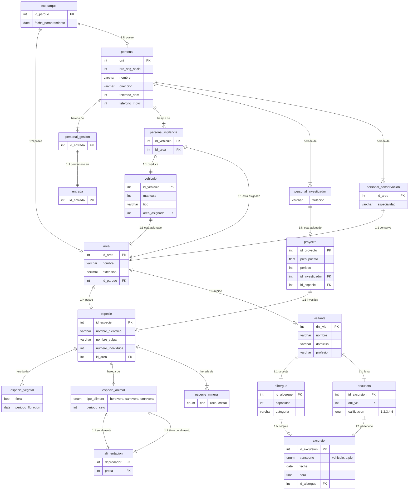

```mermaid
erDiagram

    %% ENTIDADES
    ecoparque {
        int id_parque PK
        date fecha_nombramiento
    }

    area {
        int id_area PK
        varchar nombre
        decimal extension
        int id_parque FK
    }

    especie {
      int id_especie PK
      varchar nombre_cientifico
      varchar nombre_vulgar
      int numero_individuos
      int id_area FK
    }

    especie_vegetal {
      bool flora
      date periodo_floracion
    }

    especie_animal {
      enum tipo_aliment "herbivora, carnivora, omnivora"
      int periodo_celo
    }

    especie_mineral {
      enum tipo "roca, cristal"
    }

    alimentacion {
      int depredador FK
      int presa FK
    }

    personal {
      int dni PK
      int nro_seg_social
      varchar nombre
      varchar direccion
      int telefono_dom
      int telefono_movil
    }

    personal_gestion {
      int id_entrada FK
    }

    personal_vigilancia {
      int id_vehiculo FK
      int id_area FK
    }

    personal_conservacion {
      int id_area FK
      varchar especialidad
    }

    personal_investigador {
      varchar titulacion
    }

    vehiculo {
      int id_vehiculo PK
      int matricula
      varchar tipo
      int area_asignada FK
    }

    proyecto {
      int id_proyecto PK
      float presupuesto
      int periodo
      int id_investigador FK
      int id_especie FK
    }

    entrada {
      int id_entrada PK
    }

    visitante {
      int dni_vis PK
      varchar nombre
      varchar domicilio
      varchar profesion
    }

    albergue {
      int id_albergue PK
      int capacidad
      varchar categoria
    }

    encuesta {
      int id_excursion FK
      int dni_vis FK
      enum calificacion "1,2,3,4,5"
    }

    excursion {
      int id_excursion PK
      enum transporte "vehiculo, a pie"
      date fecha
      time hora
      int id_albergue FK
    }

    %% RELACIONES
    ecoparque ||--o| area : "1:N posee"
    ecoparque ||--o| personal : "1:N posee"

    area ||--o| especie : "1:N posee"
    area ||--o| visitante : "1:N recibe"

    %% Especie y sus herencias
    especie ||--|{ especie_vegetal : "hereda de"
    especie ||--|{ especie_animal : "hereda de"
    especie ||--|{ especie_mineral : "hereda de"

    especie_animal ||--|| alimentacion : "1:1 se alimenta"
    alimentacion ||--|| especie_animal : "1:1 sirve de alimento"

    %% Personal y sus herencias
    personal ||--|{ personal_gestion : "hereda de"
    personal ||--|{ personal_vigilancia : "hereda de"
    personal ||--|{ personal_investigador : "hereda de"
    personal ||--|{ personal_conservacion : "hereda de"

    personal_gestion ||--|| entrada : "1:1 permanece en"
    
    personal_vigilancia ||--|| vehiculo : "1:1 conduce"
    personal_vigilancia ||--|| area : "1:1 esta asignado"

    personal_conservacion ||--|| area : "1:1 conserva"

    personal_investigador ||--o| proyecto : "1:N esta asignado"

    proyecto ||--|| especie : "1:1 investiga"

    vehiculo ||--|| area : "1:1 esta asignado"

    visitante ||--|| albergue : "1:1 se aloja"
    visitante ||--|| encuesta : "1:1 llena"

    albergue ||--o| excursion : "1:N se sale"

    encuesta ||--|| excursion : "1:1 pertenece"
```
