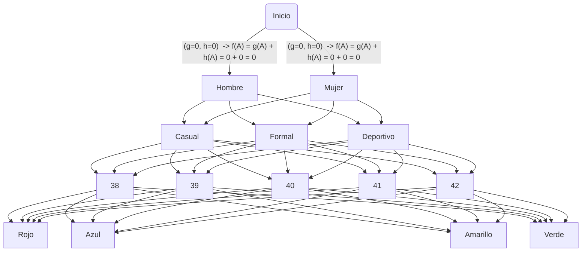

```
Nivel A: Inicio (g=0, h=0) -> f(A) = g(A) + h(A) = 0 + 0 = 0
|
|-- Nivel B: Sexo (g=5, h=5) -> f(B) = g(B) + h(B) = 5 + 5 = 10
    |
    |-- Nivel C: Tipo de Zapatos (g=5) -> f(C) = g(C) + h(C) = 5 + 5 = 10
        |
        |-- Nivel D: Medidas (g=2, h=1) -> f(D) = g(D) + h(D) = 2 + 1 = 3
            |
            |-- Nivel E: Color (g=1, h=1) -> f(E) = g(E) + h(E) = 1 + 1 = 2
                |
                |-- Zapatos para Mujeres
                |   |-- Deportivo (39, rojo)
                |      Costo total: f(CDE) = f(D) + f(E) = 3 + 2 = 5
                |
                |-- Zapatos para Hombres
                    ...
             
            ...
         
        ...
     
...

Función de costo total para el usuario: f_costo = f(A) + f(B) + f(CDE) = 0 + 10 + 5 = 15


De la pregunta anterior qué tipo de búsqueda es la más adecuada, justifique su respuesta

```
| Criterio 	| Primero en anchura 	                                      | Costo-uniforme 	                                   | Primero en profundidad 	| Profundidad limitada 	| Profundidad iterativa | Bidireccional |
|-----------|-------------------------------------------------------------|----------------------------------------------------|---------------------------|-----------------------|-----------------------|---------------|
|Completo?  | Si (garantiza encontrar la solucion mas corta - si existe -)| Sí, garantiza encontrar la solución de menor costo | No, puede quedar atrapado en ciclos infinitos o en profundidades infinitas|No, está limitada por la profundidad máxima especificada|Sí, garantiza encontrar la solución de menor profundidad|Sí, garantiza encontrar la solución si el espacio de búsqueda es finito|
|Tiempo     | Lenta para arboles grandes                                  | Depende de los costos asociados con cada acción    |Puede ser rápido en árboles de búsqueda profundos|Puede ser rápido si la profundidad máxima es adecuada|Puede ser más eficiente que la profundidad limitada al encontrar la profundidad óptima|Puede ser más eficiente al reducir el espacio de búsqueda en comparación con la búsqueda en anchura|
|Espacio    | Requiere una cantidad considerable de espacio de memoria    | Requiere más espacio que la búsqueda en anchura    |Requiere menos espacio de memoria que la búsqueda en anchura|Requiere menos espacio de memoria que la búsqueda en anchura|Requiere más espacio de memoria que la profundidad limitada, pero menos que la búsqueda en anchura|Requiere más espacio de memoria que la búsqueda en anchura, pero menos que la búsqueda bidireccional|
|Optimo?    | Sí, encuentra la solución de menor profundidad.             | Sí, encuentra la solución de menor costo           |No, puede encontrar una solución subóptima|No, puede encontrar una solución subóptima si la profundidad límite es insuficiente|Sí, encuentra la solución de menor profundidad|Sí, encuentra la solución de menor profundidad si las búsquedas hacia adelante y hacia atrás son ambas óptimas| 
```
